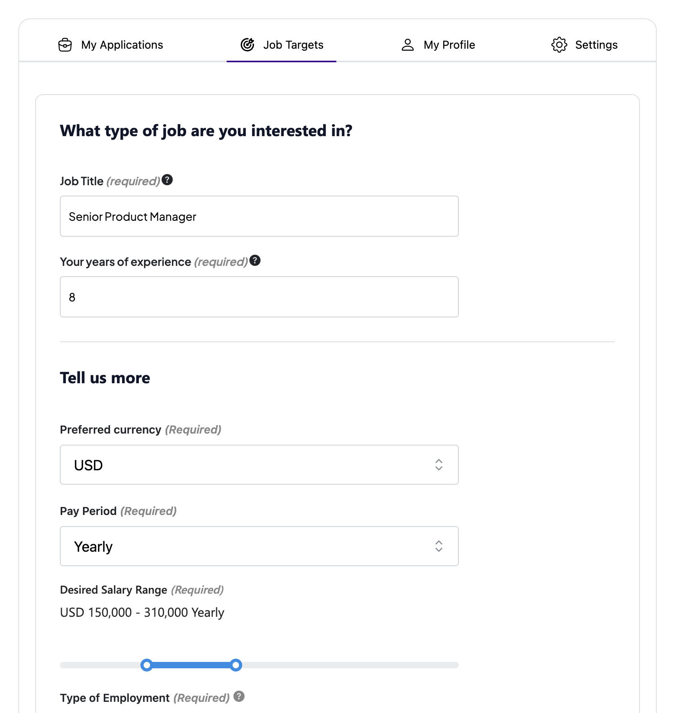
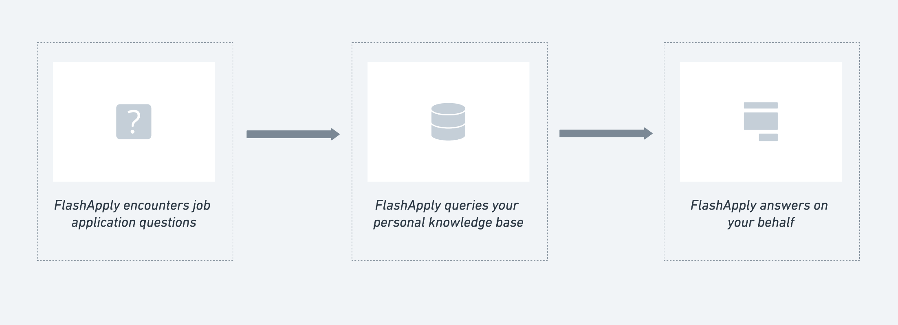
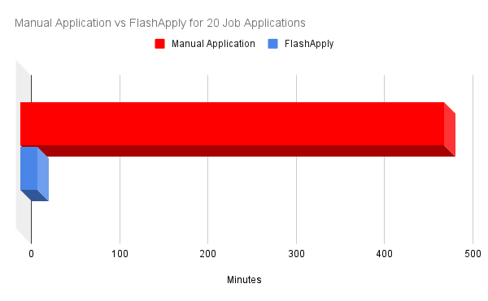

In today's fast-paced world, job hunting can often feel overwhelming—cycling through job boards, fine-tuning resumes, and filling out application after application. FlashApply is here to transform the way you find and apply for jobs using AI and automation to streamline your job search and application process.

**How it works**

First, [sign up for an account](https://flashapply.ai/login). After signing up, you'll answer a few straightforward questions to help the software understand your job-seeking preferences. You'll set up a 'Job Target'—a customized profile that outlines your ideal job scenario including desired position, salary expectations, preferred location, resume and more.

Once your job target is set, FlashApply uses this information to build a comprehensive knowledge base about you. Currently, it syncs with LinkedIn Easy Apply, but we are working very hard on expanding to additional platforms.

When you're ready to apply, simply click **"Apply on LinkedIn"** to trigger the automation process. FlashApply takes over, searching for relevant jobs and applying to them one by one. If it encounters a question requiring your input, it references your personal knowledge base for answers. In cases where no answer is found, it uses "NIKB" (Not In Knowledge Base) as a placeholder.

_How FlashApply answers questions on your behalf_

> Since FlashApply runs in copilot mode by default, all applications are put in a queue for you to review before they are sent out. Even if you turn on "Auto-pilot," applications where not all the questions can be answered are still put in a queue for you to review.

**Autopilot or Copilot Mode**

FlashApply offers two modes: Autopilot and Copilot. Autopilot mode automates the entire application process without your intervention, while Copilot lets you review applications before they're sent to employers. You have the flexibility to switch between these modes based on your preferences.

> Please note that when using FlashApply in Autopilot mode, you are responsible for the accuracy of the data and application content. 

**Limitations**

As of now, FlashApply does not generate cover letters or customize resumes for each job application. However, it excels in LinkedIn Easy Apply automation, setting the industry standard. While there may be occasional challenges with complex application forms, our team is actively addressing these issues.

**FlashApply vs manual applications**

In the fast-paced world of job hunting, let's crunch the numbers to see how applying to 20 jobs manually stacks up against using FlashApply. When applying manually, you may spend an average of 10 to 25 minutes, depending on the nature of the job. This time is usually spent on;

- reading job descriptions
- assessing suitability
- tracking applications
- answering repetitive

That easily adds up to a whopping 500 minutes or 8 hours and 20 minutes for all 20 applications.

Now, consider FlashApply's efficiency. With FlashApply, these tasks are streamlined, reducing the time spent per application to an average of 1 minute. That's just approximately 20 minutes for all 20 applications.

FlashApply, is saving you significant 8 hours in the application process. With these extra hours, you can focus on honing your interview skills, networking, or simply enjoying some well-deserved relaxation while FlashApply handles the legwork of job hunting.

**What's Next?**

Our journey with FlashApply doesn't end here. We are continually working to integrate more job sources, extending our search capabilities beyond traditional job boards to uncover hidden opportunities on the deep web.

Ready to revolutionize your job hunt? Try FlashApply today and embark on a more efficient and stress-free job hunting experience. Happy job hunting!

[Get Started with FlashApply](https://flashapply.ai/home)

